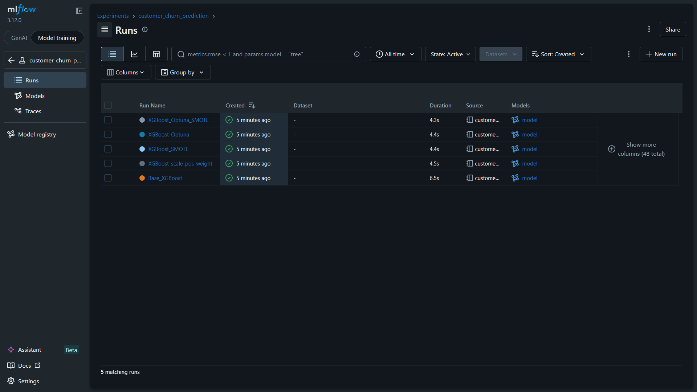
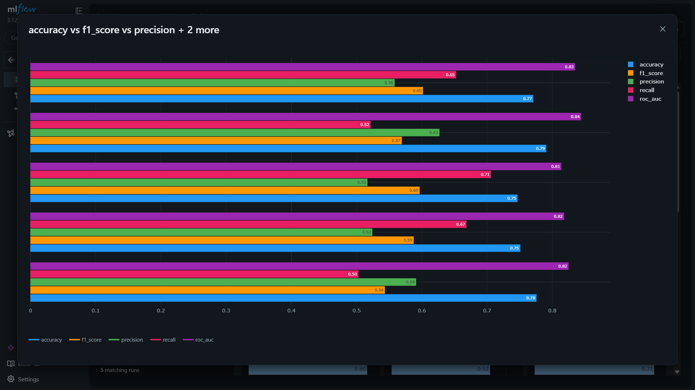
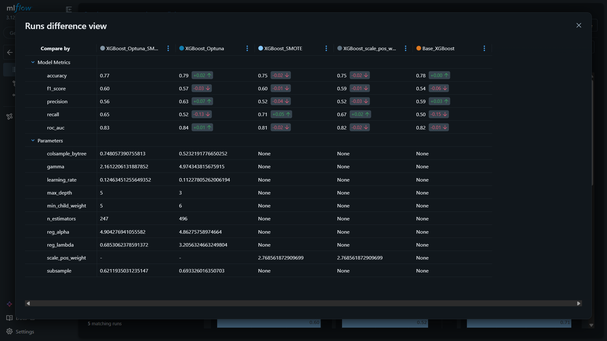
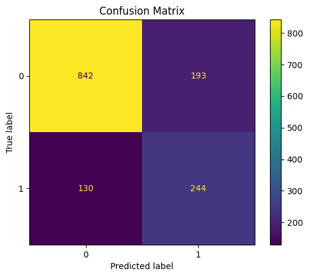
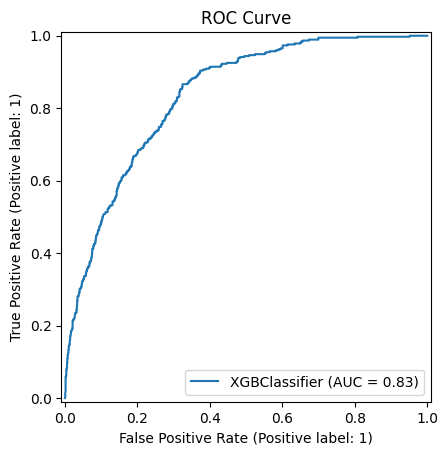
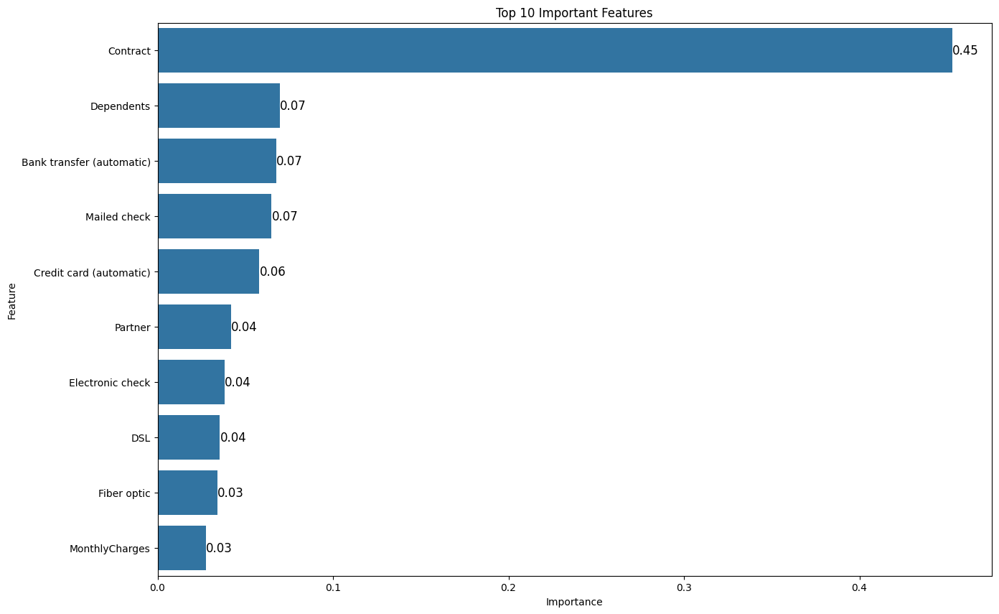

# Customer Churn Prediction using XGBoost, SMOTE, Optuna, and MLflow

## Overview

This project focuses on predicting customer churn using Machine Learning techniques with a complete end-to-end workflow including:

- Data Cleaning & Preprocessing
- Exploratory Data Analysis (EDA)
- Feature Engineering
- Handling Class Imbalance using SMOTE
- Multiple XGBoost Training Strategies
- Hyperparameter Optimization using Optuna
- Experiment Tracking using MLflow
- Model Evaluation & Comparison

The objective of this project is to identify customers likely to churn and build a robust classification model capable of handling imbalanced data effectively.

---

# Dataset

The dataset used for this project is the **Telco Customer Churn Dataset** available on Kaggle.

### Dataset Source
https://www.kaggle.com/datasets/blastchar/telco-customer-churn/data

### Dataset Description

The dataset contains customer information from a telecom company and includes features such as:

- Customer demographics
- Account information
- Services subscribed
- Contract details
- Payment methods
- Monthly and total charges
- Customer churn status

### Target Variable

- `Churn`
    - Yes → Customer left the service
    - No → Customer retained

### Dataset Size

- Rows: 7043
- Columns: 21

### Key Features

- `tenure`
- `MonthlyCharges`
- `TotalCharges`
- `Contract`
- `InternetService`
- `PaymentMethod`
- `OnlineSecurity`
- `TechSupport`
- `StreamingTV`
- `StreamingMovies`

---

# Project Workflow

## 1. Data Preprocessing

### Steps Performed

- Removed unnecessary/redundant features
- Converted categorical features into numerical format
- Handled missing and invalid values
- Applied one-hot encoding using `pd.get_dummies()`
- Created engineered features from existing attributes

### Feature Engineering

Several feature engineering techniques were applied:

- Service-related columns were consolidated into a single feature representing the total number of subscribed services.
- `InternetService` was retained separately due to its distinct customer behavior and churn patterns.
- Correlation analysis was performed to identify multicollinearity between numerical features.
- Relationships between tenure, monthly charges, total charges, contracts, and churn were analyzed.

### Correlation Analysis

Observed strong correlation between:

- `tenure` and `TotalCharges`
- `MonthlyCharges` and `TotalCharges`

This helped in understanding feature relationships and potential redundancy.

---

# Exploratory Data Analysis (EDA)

The following visualizations were performed:

- KDE plots
- Count plots
- Box plots
- Correlation heatmaps
- Feature importance plots
- Churn distribution analysis
- ROC Curve
- Confusion Matrix

### Key Observations

- Customers with lower tenure were more likely to churn.
- Fiber optic users generally had higher monthly charges.
- Month-to-month contract users exhibited higher churn rates.
- Customers with longer contracts had lower churn probability.

---

# Handling Imbalanced Data

Since the dataset was imbalanced, multiple strategies were explored:

## Without Oversampling
- Base XGBoost
- XGBoost with `scale_pos_weight`

## With Oversampling
- SMOTE + XGBoost
- SMOTE + Optuna Tuned XGBoost

SMOTE was applied only on training data to avoid data leakage.

---

# Model Training

The following models were trained and compared:

| Model | Description |
|---|---|
| Base_XGBoost | Default XGBoost model |
| XGBoost_scale_pos_weight | XGBoost with imbalance handling |
| XGBoost_SMOTE | XGBoost trained on SMOTE-balanced data |
| XGBoost_Optuna | Hyperparameter tuned XGBoost |
| XGBoost_Optuna_SMOTE | Tuned XGBoost with SMOTE |

---

# Hyperparameter Tuning using Optuna

Optuna was used for automated hyperparameter optimization.

### Hyperparameters Tuned

- `n_estimators`
- `max_depth`
- `learning_rate`
- `subsample`
- `colsample_bytree`
- `gamma`
- `min_child_weight`
- `reg_alpha`
- `reg_lambda`

Optimization objective:
- Maximize ROC-AUC Score

---

# Experiment Tracking with MLflow

MLflow was used for:

- Experiment tracking
- Logging metrics
- Logging hyperparameters
- Model versioning
- Comparing multiple runs
- Storing trained models

### Metrics Tracked

- Accuracy
- Precision
- Recall
- F1 Score
- ROC-AUC Score

---

# Best Model

## Selected Model:
### `XGBoost_Optuna_SMOTE`

### Why this model?

This model achieved the best balance between:
- Recall
- F1 Score
- ROC-AUC

while maintaining strong performance on the minority churn class.

---

# Model Performance

| Model | Accuracy | F1 Score | Precision | Recall | ROC-AUC |
|---|---|---|---|---|---|
| XGBoost_Optuna_SMOTE | 0.771 | 0.602 | 0.558 | 0.652 | 0.835 |
| XGBoost_Optuna | 0.791 | 0.569 | 0.627 | 0.521 | 0.844 |
| XGBoost_SMOTE | 0.747 | 0.597 | 0.517 | 0.706 | 0.814 |
| XGBoost_scale_pos_weight | 0.751 | 0.588 | 0.524 | 0.668 | 0.818 |
| Base_XGBoost | 0.776 | 0.543 | 0.591 | 0.503 | 0.825 |

---

# Screenshots

## MLflow Experiment Tracking

---

## Model Comparison

---

## Confusion Matrix

---

## ROC Curve

---

## Feature Importance

---

# Technologies Used

- Python
- Pandas
- NumPy
- Matplotlib
- Seaborn
- Scikit-learn
- XGBoost
- Optuna
- MLflow
- Imbalanced-learn (SMOTE)

---
